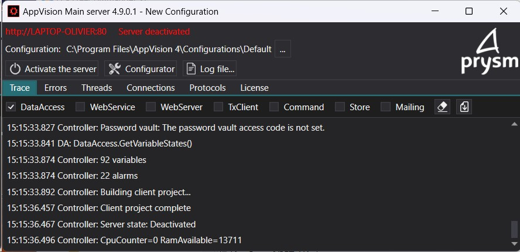
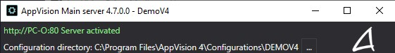

Before installing the software, close all other applications running on the system.

- Download the "Setup AppVision 4.m.n.zip" setup file from the [prysm-software.com](http://prysm-software.com) website
- Check that the downloaded zip file is not blocked (right click -> properties -> general tab). Unblock it, if necessary, then unzip it
- Run `SetupClientServer.exe` and the instructions in the `readme.txt` file
- The installation process is self-documented, follow the instructions of the installation program

Installing the server software creates shortcuts on the Windows desktop:

- _"AppVision configurator"_, the AppVision™ configuration tool called the Configurator below
- _"AppVision server"_, AppVision™ server
- _"AppVision client"_, an AppVision™ client called the appClient below

On the server, you need to add a rule to the Windows firewall to allow incoming connections on TCP port 80. You must check that there is no proxy installed on port 80 in the Internet options.


### APPSERVER.EXE.CONFIG

The file `appserver.exe.config` contains configuration parameters of the AppVision™ server process

The settings are configured in the `<appSettings>` section, for example:

```
<appSettings>
    <add key="PortWebServer" value="80" />
    <add key="PortWebServerHttps" value="443" />
    <add key="StartSupervision" value="True" />
    <add key="DataDirectory" value="C:\Program Files\AppVision 4\Configurations_Default\"/>
</appSettings>
```

### List of parameters:

<table>
    <thead>
        <tr class="first-row">
            <th style="white-space: nowrap;">NAME</th>
            <th>DESCRIPTION</th>
        </tr>
    </thead>
    <tbody>
        <tr>
            <td style="white-space: nowrap;">`DataDirectory`</td>
            <td>Directory of the active configuration</td>
        </tr>
        <tr>
            <td style="white-space: nowrap;">`DiagnosticEnable`</td>
            <td>True/False: enable regular recording of performance counters in the activity files located in the `{$Config}\Histog` directory (True by default).</td>
        </tr>
        <tr>
            <td style="white-space: nowrap;">`DisableSynchroInitial`</td>
            <td>Forbids initial synchronization in a redundant server (False by default)</td>
        </tr>
        <tr>
            <td style="white-space: nowrap;">`DisableAutoUpdate`</td>
            <td>Prohibit automatic update in a redundant server or in a mirror server (False by default)</td>
        </tr>
        <tr>
            <td style="white-space: nowrap;">`DisableUpdateDatabase`</td>
            <td>Forbid automatic update of the database structure (False by default)</td>
        </tr>
        <tr>
            <td style="white-space: nowrap;">`IgnoreTLSCertificateErrors`</td>
            <td>Indicates if in HTTPS we ignore certificate errors (False by default)</td>
        </tr>
        <tr>
            <td style="white-space: nowrap;">`PathBackup`</td>
            <td>Directory containing the configuration backup files (by default `C:\Program Files\AppVision 4\DefaultBackup`).</td>
        </tr>
        <tr>
            <td style="white-space: nowrap;">`PathLogFiles`</td>
            <td>Directory containing the trace files (.log) (by default `C:\ProgramData\AppVision 4\LogFiles`).</td>
        </tr>
        <tr>
            <td style="white-space: nowrap;">`PortWebServer`</td>
            <td>See details below.</td>
        </tr>
        <tr>
            <td style="white-space: nowrap;">`PortWebServerHttps`</td>
            <td>See details below.</td>
        </tr>
        <tr>
            <td style="white-space: nowrap;">`ServerName`</td>
            <td>Specifies the server's name (used by multi-server architectures) (default is Windows machine name)</td>
        </tr>
        <tr>
            <td style="white-space: nowrap;">`StartSupervision`</td>
            <td>True/False: to enable hypervision at process launch (False by default)</td>
        </tr>
        <tr>
            <td style="white-space: nowrap;">`SystemPassword`</td>
            <td>System password (only used for redundant or mirror servers)</td>
        </tr>
        <tr>
            <td style="white-space: nowrap;">`Update_SqlTimeout`</td>
            <td>Timeout in seconds used when modifying a table (1800 by default)</td>
        </tr>
        <tr>
            <td style="white-space: nowrap;">`URLPrimaryServer`</td>
            <td>Primary server URL in a redundant server context</td>
        </tr>
        <tr>
            <td style="white-space: nowrap;">`URLPrimaryMirrorServer`</td>
            <td>URL of the 1st mirror server in a mirror server context</td>
        </tr>
    </tbody>
</table>


PortWebServer and PortWebServerHttps parameters: these 2 parameters allow you to specify the server's listening ports for client connections. By default the server is configured to use TCP port 80 for the http protocol and TCP port 443 for the https protocol.


### Launch the Server

Before launching the server:

- Place the dongle in a USB port on your system
- Wait for the key to be recognized by the system

Or activate the license for a demo version by opening the Configurator, menu `License` -> `License Activation` (bottom right button) and select the `Appkey` file.

To start the server double-click on the desktop shortcut `Server`.

<p style="text-align: center;"></p>

- The upper-left message indicates the status of AppVision™:
  - Orange: initialization process of the server
  - Red: the server is not active
  - Green: the server is active

<p style="text-align: center;"></p>

The active state of the server indicates that AppVision™ dialogues with the equipment and the clients can connect to it.

- Click the "Active / Deactivate the Server" button to change AppVision™ status.
- The "Config files..." button opens the current configuration directory (`C:\Program Files\AppVision 4\Configurations\Default` in our example) to change the current configuration.
- The "Log files..." button opens the log directory (the log files of the application and modules, `C:\ProgramData\AppVision 4\LogFiles\yyyy\appServer` by default).

After one minute the server is automatically hidden, an icon in the notification bar indicates that it is working, a double-click on this icon allows you to display it again, click on the minimize button in the title bar to hide it.

:::note
- To open the server in selecting a configuration, hold the SHIFT key and click on the server shortcut on the desktop.
- In a production context, the AppVision™ server can be started as a service, see [Configure the Windows AppVision™ service](#).
:::
