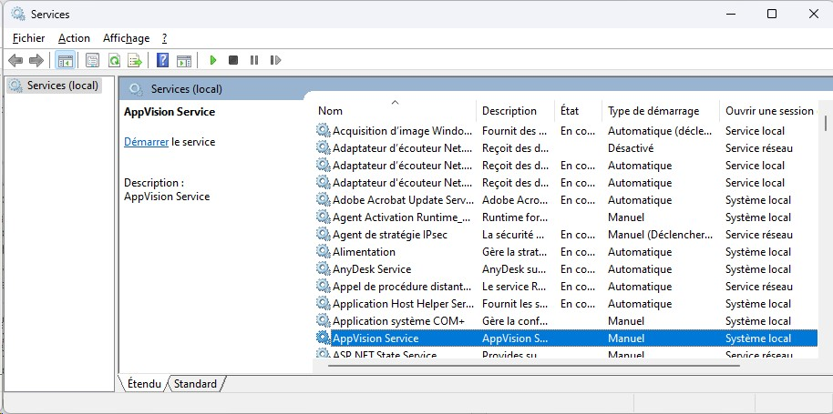

When AppVision™ is installed on the server workstation, the setup program creates a Windows service called AppVision Service.

This service is configured by default as Manual. For an automatic launch of the AppVision™ server it must be configured in delayed automatic mode.

:::note
Note: in the case of launching the AppVision™ server in service mode, the AppVision™ server icon is no longer visible in the Windows notification bar.
:::
